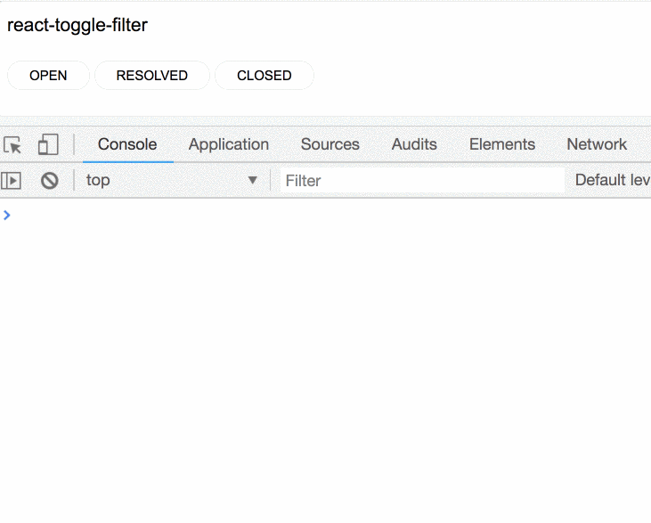

# react-toggle-filter
A component for filter control using toggles with easily customizable styling.



## Installation

```
yarn add react-toggle-filter
```

or

```
npm install react-toggle-filter
```

## Running a Demo
To run a local demo of `react-toggle-filter`:
- clone this repo
- install dependencies
- run `yarn storybook`.

## Usage
For basic use provide an array of strings to use as filter options and a handler function for `onItemToggle` callback:

```
<ToggleFilter
    items={['Open', 'Resolved', 'Closed']}
    onItemToggle={
        (selectedItems, allItems) => {
            console.log('Selected items:', selectedItems);
        }
    }/>
```

More detailed examples can be found in `stories/index.js`.